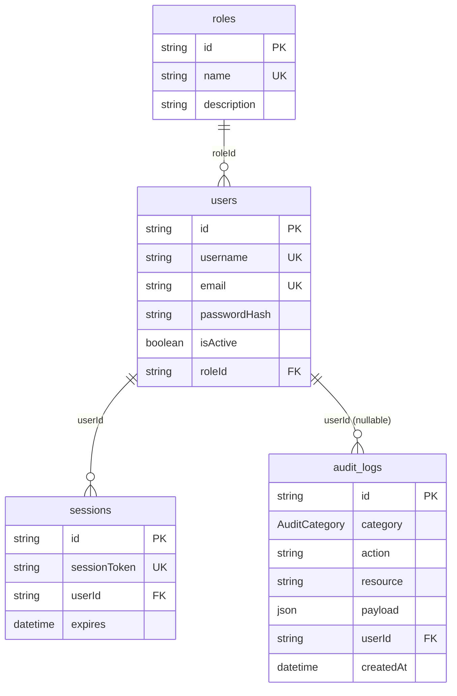

# Datenmodell Auth / RBAC / Audit (IPA-201)

Dieses Dokument ergänzt den IPA-Bericht (Teil 2) und beschreibt das relationale Modell in PostgreSQL, verwaltet mit **Prisma ORM**.

## Entscheidung für Prisma

- **Typsicherheit:** Der generierte Client passt zu TypeScript und vermeidet String-SQL in der Applikationsschicht.
- **Migrationen:** Schema und Datenbank bleiben über `prisma/migrations` reproduzierbar versioniert (DoD: ausführbares Migrationsskript).
- **Team- und IPA-Nachvollziehbarkeit:** Ein einziges `schema.prisma` ist Review- und dokumentationsfreundlich.

## Tabellenüberblick

| Tabelle       | Zweck |
|---------------|--------|
| `roles`       | Referenz für RBAC (`ADMIN`, `BASIC`); klare Rollentrennung im Berechtigungskonzept. |
| `users`       | Benutzer mit `username` (TAA), optional `passwordHash`, FK auf `roles`. |
| `sessions`    | Sitzungen für Auth.js/NextAuth-kompatibles Session-Handling (`sessionToken`, `expires`). |
| `audit_logs`  | Append-only Audit; `category` unterscheidet u. a. NRT- vs. Account-Kontext. |

## Stakeholder-Präzisierung (Audit)

Das Enum `AuditCategory` enthält u. a.:

- **`NRT_RULE_CHANGE`** — Regeländerungen im NRT-Kontext; nach Stakeholder-Abstimmung für **alle authentifizierten Nutzer** sichtbar (inkl. BASIC), sobald die API/UI dies freigibt.
- **`ACCOUNT`** — kontospezifische, vertrauliche Einträge; **nur ADMIN** (Abgleich mit Bericht / TC11–TC12).

Die technische Durchsetzung (Guards, Filter) erfolgt in den Auth-/Audit-Stories von Sprint 2; das Schema legt die **fachliche Trennung** bereits fest.

## ER-Diagramm (Mermaid)

## Erweiterung IPA-202

Die Tabelle **`registration_requests`** hält Registrierungsanträge mit Status `PENDING_APPROVAL` (bcrypt-gehashte Passwörter). Siehe **[SIGNUP_IPA-202.md](./SIGNUP_IPA-202.md)**.

## Lokales Setup

1. `docker compose up -d`
2. `.env` aus `.env.example` ableiten (`DATABASE_URL`)
3. `npx prisma migrate deploy` (oder `npm run db:migrate` in Entwicklung)
4. `npm run db:seed` (optional Testdaten)

## Tests

Integrationstests: `tests/db/prisma.integration.test.ts` (positiv: User mit Rolle; negativ: FK-Verletzung).

- Standard: `npm test` — überspringt DB-Tests (kein lokales Postgres nötig).
- Mit Datenbank: `docker compose up -d`, `npx prisma migrate deploy`, `npm run db:seed`, dann **`npm run test:db`** (setzt `RUN_DB_INTEGRATION=1` und nutzt `DATABASE_URL` aus `.env`).
